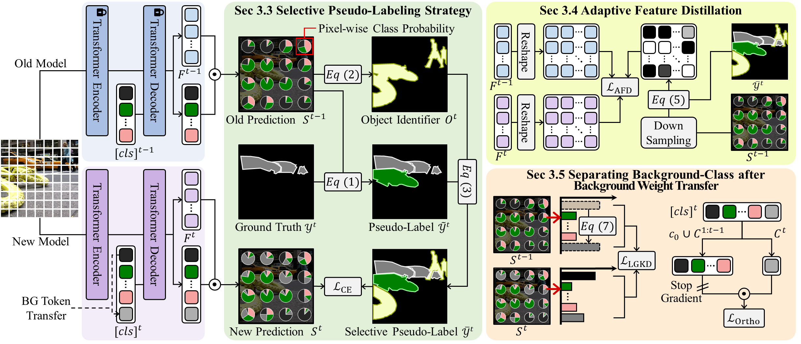
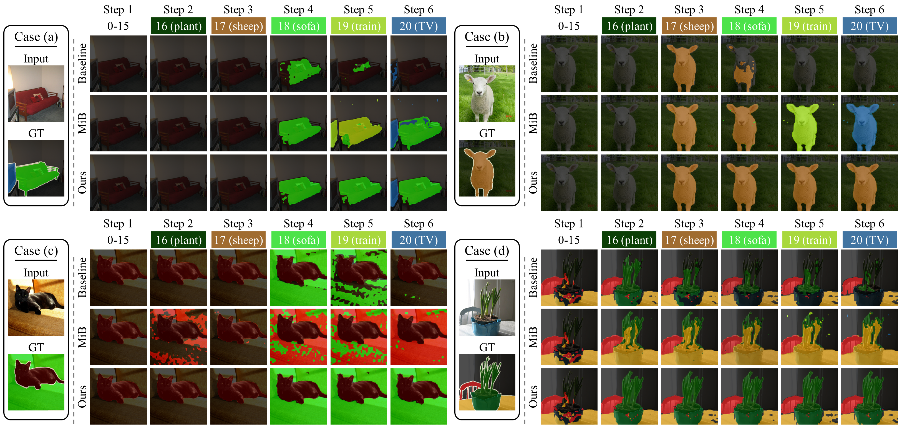

# Mitigating Background Shift in Class-Incremental Semantic Segmentation

> Gilhan Park, WonJun Moon, SuBeen Lee, Tae-Young Kim, and Jae-Pil Heo <br>
> Sungkyunkwan University

[](https://arxiv.org/abs/)



## Updates & News
- Our new paper, "Mitigating Background Shift in Class-Incremental Semantic Segmentation" will soon be posted on Arxiv. The title and code are currently available.
- Our paper has been accepted at **ECCV 2024**.

## Abtract
Class-Incremental Semantic Segmentation (CISS) aims to learn new classes without forgetting the old ones, using only the labels of the new classes. To achieve this, two popular strategies are employed: 1) pseudo-labeling and knowledge distillation to preserve prior knowledge; and 2) background weight transfer, which leverages the broad coverage of background in learning new classes by transferring background weight to the new class classifier. However, the first strategy heavily relies on the old model in detecting old classes while undetected pixels are regarded as the background, thereby leading to the background shift towards the old classes (i.e., misclassification of old class as background). Additionally, in the case of the second approach, initializing the new class classifier with background knowledge triggers a similar background shift issue, but towards the new classes. To address these issues, we propose a background-class separation framework for CISS. To begin with, selective pseudo-labeling and adaptive feature distillation are to distill only trustworthy past knowledge. On the other hand, we encourage the separation between the background and new classes with a novel orthogonal objective along with label-guided output distillation. Our state-of-the-art results validate the effectiveness of these proposed methods.
## Requirements
Conda environment settings:
```
conda create -n MBS python=3.8
conda activate MBS
```
You need to install the following libraries:
```
pip install torch==1.10.1+cu111 torchvision==0.11.2+cu111 torchaudio==0.10.1 -f https://download.pytorch.org/whl/torch_stable.html
pip install -r requirements.txt
pip install -U openmim
mim install mmcv
```
## Datasets
```
data_root/
    ├── VOCdevkit
    │   └── VOC2012/
    │       ├── Annotations/
    │       ├── ImageSet/
    │       ├── JPEGImages/
    │       └── SegmentationClassAug/
    ├── ADEChallengeData2016
    │   ├── annotations
    │   │   ├── training
    │   │   └── validation
    │   └── images
    │       ├── training
    │       └── validation
```
> ### PASCAL VOC 2012
> Download PASCAL VOC2012 devkit (train/val data)
> ``` bash
> sh download_voc.sh
> ```
> - download_voc.sh
> ```bash
>cd data_root
>
>wget http://host.robots.ox.ac.uk/pascal/VOC/voc2012/VOCtrainval_11-May-2012.tar
>tar -xf VOCtrainval_11-May-2012.tar
>wget http://cs.jhu.edu/~cxliu/data/SegmentationClassAug.zip
>wget http://cs.jhu.edu/~cxliu/data/SegmentationClassAug_Visualization.zip
>wget http://cs.jhu.edu/~cxliu/data/list.zip
>rm VOCtrainval_11-May-2012.tar
>
>unzip SegmentationClassAug.zip
>unzip SegmentationClassAug_Visualization.zip
>unzip list.zip
>
>mv SegmentationClassAug ./VOCdevkit/VOC2012/
>mv SegmentationClassAug_Visualization ./VOCdevkit/VOC2012/
>mv list ./VOCdevkit/VOC2012/
>
>rm list.zip
>rm SegmentationClassAug_Visualization.zip
>rm SegmentationClassAug.zip
> ```
> ### ADE20k
> ```
> python download_ade20k.py
> ```

## Training & Test
```
sh main.sh
```
We provide a training script ``main.sh``. Detailed training argumnets are as follows:
```sh
python -m torch.distributed.launch --nproc_per_node={num_gpu} --master_port={port} main.py --config ./configs/voc.yaml --log {your_log_name}
```

## Qualitative Results


## BibTex
If you find the repository or the paper useful, please use the following entry for citation.
````BibTeX
coming soon
````

## Contributors and Contact
If there are any questions, feel free to contact the authors: Gilhan Park (a01152a@gmail.com), WonJun Moon (wjun0830@gmail.com), SuBeen Lee (leesb7426@gmail.com), Tae-Young Kim (vanmeruso@gmail.com).